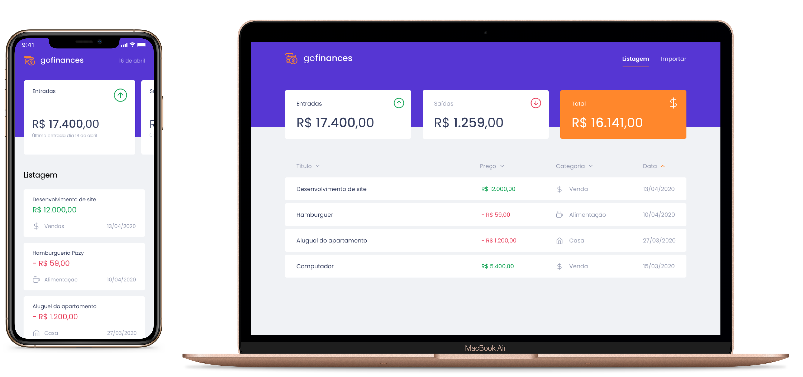

<h1 align="center">
  
</h1>

<h3 align="center">
  Finances control application <br/> Application de contrôle des finances
</h3>

<p align="center">
  

  <a href="https://www.linkedin.com/in/rodvalentim/">
    
  </a>
  
  
  
  <a href="https://github.com/rodrigovalentim/gofinances/commits/master">
    
  </a>
  
  <a href="https://github.com/rodrigovalentim/gofinances/issues">
    
  </a>
  
  
</p>

<p align="center">
  <a href="#-about-the-project">About the project</a>&nbsp;&nbsp;&nbsp;|&nbsp;&nbsp;&nbsp;
  <a href="#-technologies">Technologies</a>&nbsp;&nbsp;&nbsp;|&nbsp;&nbsp;&nbsp;
  <a href="#-getting-started">Getting started</a>&nbsp;&nbsp;&nbsp;|&nbsp;&nbsp;&nbsp;
  <a href="#-how-to-contribute">How to contribute</a>&nbsp;&nbsp;&nbsp;|&nbsp;&nbsp;&nbsp;
  <a href="#-license">License</a>
</p>

<!-- <p id="insomniaButton" align="center">
  <a href="" target="_blank">
    
  </a>
</p> -->



## 💰 About the project

GoFinances is the application for who want to control your finances. With the feature to import a CSV (Comma-separated values) file you can bulk insert a lot of transactions.

GoFinances est l'application pour qui veut contrôler ses finances. Avec la fonction pour importer un fichier CSV (valeurs séparées par des virgules), vous pouvez insérer en masse un grand nombre de transactions.

## 🚀 Technologies

Technologies that I used to develop this api

- [Node.js](https://nodejs.org/)
- [ReactJS](https://reactjs.org/)
- [React Native](https://reactnative.dev/)
- [TypeScript](https://www.typescriptlang.org/)
- [TypeORM](https://typeorm.io/#/)
- [Express](https://expressjs.com/pt-br/)
- [PostgreSQL](https://www.postgresql.org/)
- [Jest](https://jestjs.io/)
- [SuperTest](https://github.com/visionmedia/supertest)
- [React Router DOM](https://reacttraining.com/react-router/)
- [React Navigation](https://reactnavigation.org/)
- [React Icons](https://react-icons.netlify.com/#/)
- [Styled Components](https://styled-components.com/)
- [Axios](https://github.com/axios/axios)
- [Eslint](https://eslint.org/)
- [Prettier](https://prettier.io/)
- [EditorConfig](https://editorconfig.org/)

## 💻 Getting started

<!-- Importe o arquivo `Insomnia.json` no Insomnia ou clique no botão [Run in Insomnia](#insomniaButton) -->

### Requirements

- [Node.js](https://nodejs.org/en/)
- [Yarn](https://classic.yarnpkg.com/) or [npm](https://www.npmjs.com/)
- One instance of [PostgreSQL](https://www.postgresql.org/)

> Obs.: I recommend use docker

> Obs.: Je recommande d'utiliser Docker

**Clone the project and access the folder**

```bash
Back-end
$ git clone https://github.com/rodrigovalentim/gofinancesbackend.git && cd gofinancesbackend
```

**Follow the steps below**

### Backend

```bash
# Install the dependencies
$ yarn

# Create the instance of postgreSQL using docker
$ docker run --name gofinances-postgres -e POSTGRES_USER=docker -e POSTGRES_PASSWORD=docker -e POSTGRES_DB=gofinances -p 5432:5432 -d postgres

# Make sure the keys in 'ormconfig.json' to connect with your database
# are set up correctly.

# Once the services are running, run the migrations
$ yarn typeorm migration:run

# To finish, run the api service
$ yarn dev:server

# Well done, backend is started!
```

### Web

_Obs.: Before to continue, be sure to have the API running_

```bash
Front-end
$ git clone https://github.com/rodrigovalentim/gofinances.git && cd gofinances

# Install the dependencies
$ yarn

# Be sure the file 'src/services/api.ts' have the IP to your API

# Start the client
$ yarn start
```

### Mobile

<!-- _ps: Antes de executar, lembre-se de iniciar o backend deste projeto_ -->

<p align="center">
 Yet in development!
 <br />
 
</p>

## 🤔 How to contribute

**Make a fork of this repository**

```bash
# Fork using GitHub official command line
# If you don't have the GitHub CLI, use the web site to do that.

$ gh repo fork rodrigovalentim/gofinances
```

**Follow the steps below**

```bash
# Clone your fork
$ git clone your-fork-url && cd gofinances

# Create a branch with your feature
$ git checkout -b my-feature

# Make the commit with your changes
$ git commit -m 'feat: My new feature'

# Send the code to your remote branch
$ git push origin my-feature
```

After your pull request is merged, you can delete your branch

## 📝 License

This project is licensed under the MIT License - see the [LICENSE](LICENSE) file for details.

---

Made with 💜 by Rodrigo Valentim 👋 [See my linkedin](https://www.linkedin.com/in/rodvalentim)
